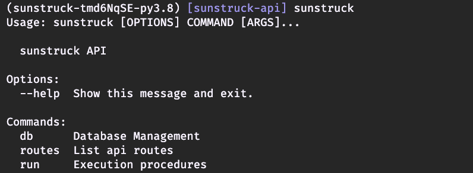

<div style="text-align:center;">
  <table >
    <tr>
      <a href="(https://circleci.com/gh/la-mar/sunstruck-api">
        
      </a>
      <a href="https://codecov.io/gh/la-mar/sunstruck-api">
        
      </a>
        <!-- <a href="https://hub.docker.com/r/brocklfriedrich/sunstruck-api">
        
      </a> -->
    </tr>
  </table>
</div>

# sunstruck-api

# About

This is a generic application that is built with the intention of providing a thoughtfully
designed, detailed, and approachable example of an API implementation using FastAPI. This project
focuses on demonstrating tangible solutions for the functionality most often needed when
implementing a new API, with the goal of providing the members of the Python and FastAPI
communities with yet another reference point for enhancing their own implementations.

Here are a few quick facts about what you'll find in this project:

- [FastAPI](https://github.com/tiangolo/fastapi): Web Framework
- [Gino](https://github.com/python-gino/gino): Async SQL ORM
- [TimescaleDB](https://github.com/timescale/timescaledb): Timescale (Postgres) database

- Authentication with OAuth2: Both password and client_credentials flows are implemented.
  - See the [auth helpers](./src/sunstruck/api/helpers/auth.py#L15-L95) and [access-token endpoint](./src/sunstruck/api/v1/endpoints.auth.py#L28-L61#)

<br/>

# Usage & Development

##### Required tools:

- Python >=3.8.0
- [Poetry Package Manager](https://python-poetry.org/docs/#installation)
- Docker

##### Optional tools:

- jq `brew install jq`
- make `brew install make`
- httpie `brew install httpie`

### Environment

Environment variables can either be defined at the system level or in a filed named '.env' in the project's root directory.

Example .env file for local development:

```sh
# .env
PYTHONPATH=./:./src/sunstruck:./src:${PYTHONPATH}

ENV=development

DATABASE_NAME=sunstruck
DATABASE_USERNAME=sunstruck
DATABASE_PASSWORD=password
DATABASE_HOST=0.0.0.0
DATABASE_PORT=5432

LOG_LEVEL=20
LOG_FORMAT=simple
DEBUG=false
SECRET_KEY=local

# master account credentials
MASTER_EMAIL=user@example.com
MASTER_PASSWORD=password

# for timescaledb container
POSTGRES_USER=sunstruck
POSTGRES_PASSWORD=password

```

## Installation

1. Install Poetry: `pip3 install poetry`
2. Install the project dependencies defined in [pyproject.toml](pyproject.toml): `poetry install`
3. Source your .env file if your IDE/terminal doesn't do so automatically: `source .env`
4. Optional: Populate the database with sample data [sample data](docs/data): `poetry run seed_db`
5. Launch the application and its supporting components: `docker-compose up`

- If you need to startover with a clean database, you can generate a fresh one by
  running `make recreate-and-seed-db`.

### Commands

Several frequently needed and useful commands are captured in the [Makefile](Makefile).

### CLI Reference

You can verify you have installed the project by running:

```sh
sunstruck --help
```



<br/>

If you get an error saying the app can't be found, make sure the Poetry virtual
environment is active (`poetry shell`)

<br/>

##### Commands

```sh
# Application Control Commands
sunstruck run dev
sunstruck run web
```

```sh
# Information Display Commands
sunstruck routes
```

```sh
# Database Management Commands
sunstruck db downgrade
sunstruck db migrate
sunstruck db recreate
sunstruck db upgrade
```

<br/>
<br/>

### API

The API documentation is viewable at http://0.0.0.0:8000/docs when the app
container is running.

You can verify the API is available by checking the health endpoint:

```sh
curl http://0.0.0.0:8000/api/v1/health
```

<br/>

#### Example Requests:

All examples below will use HTTPie.

##### Available Endpoints

### Database Schema

The database schema is managed by the application through a combination of SQLAlchemy
and Alembic. The schema migrations produced by Alembic can be found [here](src/sunstruck/db/migrations/versions).

# TODO

#### API Improvements

- Batch POSTing endpoint
- Implement Auth (OAuth2):
  <!-- - Password flow -->

  - Client Credentials flow
  - Generate/view client credentials in user profile
  - A user account can be tied to multiple client credentials

  - Social login (google, twitter, github)
  - More intuitive pagination
    - Can the response be modified from inside the dependency (e.g. adding headers)?

#### Database Improvements

- Add Row Level Security / Row Ownership

#### Testing Improvements

- Update httpx dispatchers to >v11
- Create testing-only database models

#### Other Improvements

- Convert config to Pydantic?

- Refactor util.jsontools to jsonlib
- Logging config file to configure levels by logger

# Inspiration

Many pieces of this codebase have been inspired by various projects in the FastAPI community:

- [Tiangolo's Full-Stack-FastAPI-Postgresql](https://github.com/tiangolo/full-stack-fastapi-postgresql)
- [FastAPI-React](https://github.com/Buuntu/fastapi-react)
- [FastAPI-Contrib](https://github.com/identixone/fastapi_contrib)
